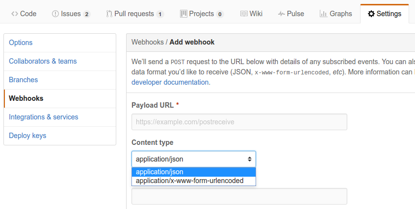
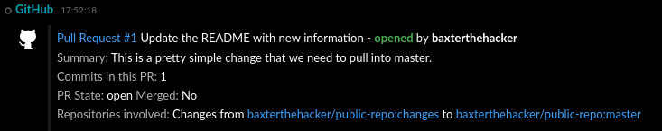
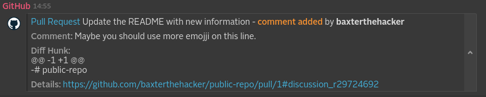
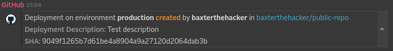
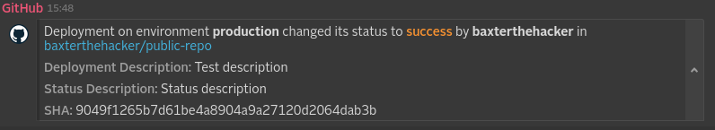
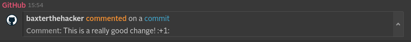
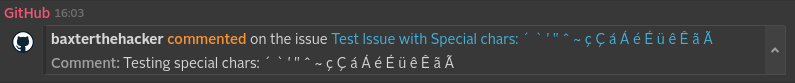
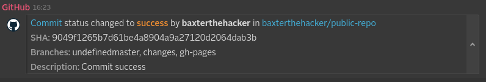

_Note that this project depends on internal Symphony infrastructure (repository.symphony.com), and therefore it can only be built by Symphony LLC employees/partners._

# GitHub WebHook Integration
The GitHub Webhook Integration will allow you to receive notifications in Symphony whenever you make a code-push, pull request, comments on pull requests, issues, comments on issues, merges, and the latest deployment status.

## How it works
As a GitHub admin of a repository you can configure a WebHook to post messages in a URL you generate in the GitHub WebHook Application available on Symphony Market and then you'll start receiving notifications for the supported events.
As of the current version, one must configure the WebHook **Content Type** as *application/json* as shown below:



## What formats and events it supports and what it produces
Every integration will get a message sent in a specific format (depending on what system it is dealing with) and it will usually convert it into an "entity" before it reaches the Symphony platform.
It will also, usually, identify the kind of message it will deal with based on an "event" identifier, that varies based on which system it is integrating with.

Currently we are supporting the following ten events from GitHub: *Push, 
Pull Request, Pull Request Review Comment, Deployment, Deployment Status, Commit Comment, Issue Comment, Public, Release, Status*. Those can be found while configuring a WebHook on GitHub by the names mentioned here.

We identify those events by looking at a header parameter that GitHub sends along with the requests, by the key *X-GitHub-Event*

Below we'll detail each one of those events

### Push
* Event key: push
* GitHub JSON message sent
[Push JSON file](src/docs/sample/payload_xgithubevent_push.json)
* Message ML generated by the parsers
```xml
<messageML>
    <entity type="com.symphony.integration.github.event.push" version="1.0">
        <presentationML>
            baxterthehacker pushed changes to [baxterthehacker/public-repo:changes], see details at: <a href="https://github.com/baxterthehacker/public-repo/compare/9049f1265b7d%5E...0d1a26e67d8f"/>
        </presentationML>
        <attribute name="compare" type="com.symphony.uri" value="https://github.com/baxterthehacker/public-repo/compare/9049f1265b7d%5E...0d1a26e67d8f"/>
        <attribute name="ref" type="org.symphonyoss.string" value="refs/heads/changes"/>
        <attribute name="ref_type" type="org.symphonyoss.string" value="branch"/>
        <entity type="com.symphony.integration.github.commits" version="1.0">
            <entity name="0d1a26e67d8f5eaf1f6ba5c57fc3c7d91ac0fd1c" type="com.symphony.integration.github.commit" version="1.0">
                <attribute name="id" type="org.symphonyoss.string" value="0d1a26e67d8f5eaf1f6ba5c57fc3c7d91ac0fd1c"/>
                <attribute name="message" type="org.symphonyoss.string" value="Update README.md"/>
                <attribute name="timestamp" type="org.symphonyoss.time.rfc3339" value="2015-05-05T19:40:15-04:00"/>
                <attribute name="url" type="com.symphony.uri" value="https://github.com/baxterthehacker/public-repo/commit/0d1a26e67d8f5eaf1f6ba5c57fc3c7d91ac0fd1c"/>
                <entity name="author" type="com.symphony.integration.github.user" version="1.0">
                    <attribute name="name" type="org.symphonyoss.string" value="baxterthehacker"/>
                    <attribute name="email" type="org.symphonyoss.string" value="baxterthehacker@users.noreply.github.com"/>
                    <attribute name="username" type="org.symphonyoss.string" value="baxterthehacker"/>
                </entity>
                <entity name="committer" type="com.symphony.integration.github.user" version="1.0">
                    <attribute name="name" type="org.symphonyoss.string" value="baxterthehacker"/>
                    <attribute name="email" type="org.symphonyoss.string" value="baxterthehacker@users.noreply.github.com"/>
                    <attribute name="username" type="org.symphonyoss.string" value="baxterthehacker"/>
                </entity>
            </entity>
        </entity>
        <entity name="head_commit" type="com.symphony.integration.github.commit" version="1.0">
            <attribute name="id" type="org.symphonyoss.string" value="0d1a26e67d8f5eaf1f6ba5c57fc3c7d91ac0fd1c"/>
        </entity>
        <entity name="repository" type="com.symphony.integration.github.repository" version="1.0">
            <attribute name="full_name" type="org.symphonyoss.string" value="baxterthehacker/public-repo"/>
            <attribute name="id" type="org.symphony.oss.number.long" value="35129377"/>
            <attribute name="html_url" type="com.symphony.uri" value="https://github.com/baxterthehacker/public-repo"/>
        </entity>
        <entity name="pusher" type="com.symphony.integration.github.user" version="1.0">
            <attribute name="name" type="org.symphonyoss.string" value="baxterthehacker"/>
            <attribute name="email" type="org.symphonyoss.string" value="baxterthehacker@users.noreply.github.com"/>
        </entity>
        <entity name="sender" type="com.symphony.integration.github.user" version="1.0">
            <attribute name="login" type="org.symphonyoss.string" value="baxterthehacker"/>
            <attribute name="id" type="org.symphony.oss.number.long" value="6752317"/>
        </entity>
    </entity>
</messageML>
```
* Message rendered on Symphony


### Pull Request
* Event key: pull_request
* Actions supported: *opened, assigned, closed, labeled*
* GitHub JSON message sent
[Pull Request Opened JSON file](src/docs/sample/payload_xgithubevent_pull_request.json)
* Message ML generated by the parsers
```xml
<messageML>
    <entity type="com.symphony.integration.github.event.pull_request" version="1.0">
        <presentationML>
            Pull request opened by Baxter The Hacker<br/>
            [Update the README with new information]<br/>
            Merging 1 commits into "baxterthehacker/public-repo:master" from "baxterthehacker/public-repo:changes"<br/>
            You can check this pull request online at: <a href="https://github.com/baxterthehacker/public-repo/pull/1"/><br/>
            Commit Summary:<br/>
            This is a pretty simple change that we need to pull into master.
        </presentationML>
        <attribute name="action" type="org.symphonyoss.string" value="opened"/>
        <attribute name="merged" type="org.symphonyoss.string" value="false"/>
        <attribute name="number" type="org.symphony.oss.number.int" value="1"/>
        <attribute name="commits" type="org.symphony.oss.number.int" value="1"/>
        <attribute name="repo_branch_head" type="org.symphonyoss.string" value="baxterthehacker/public-repo:changes"/>
        <attribute name="repo_branch_base" type="org.symphonyoss.string" value="baxterthehacker/public-repo:master"/>
        <attribute name="id" type="org.symphony.oss.number.long" value="34778301"/>
        <attribute name="state" type="org.symphonyoss.string" value="open"/>
        <attribute name="title" type="org.symphonyoss.string" value="Update the README with new information"/>
        <attribute name="body" type="org.symphonyoss.string" value="This is a pretty simple change that we need to pull into master."/>
        <attribute name="html_url" type="com.symphony.uri" value="https://github.com/baxterthehacker/public-repo/pull/1"/>
        <attribute name="created_at" type="org.symphonyoss.time.rfc3339" value="2015-05-05T23:40:27Z"/>
        <attribute name="updated_at" type="org.symphonyoss.time.rfc3339" value="2015-05-05T23:40:27Z"/>
        <entity name="repo_head" type="com.symphony.integration.github.repository" version="1.0">
            <attribute name="full_name" type="org.symphonyoss.string" value="baxterthehacker/public-repo"/>
            <attribute name="branch" type="org.symphonyoss.string" value="changes"/>
            <attribute name="id" type="org.symphony.oss.number.long" value="35129377"/>
            <attribute name="html_url" type="com.symphony.uri" value="https://github.com/baxterthehacker/public-repo"/>
        </entity>
        <entity name="repo_base" type="com.symphony.integration.github.repository" version="1.0">
            <attribute name="full_name" type="org.symphonyoss.string" value="baxterthehacker/public-repo"/>
            <attribute name="branch" type="org.symphonyoss.string" value="master"/>
            <attribute name="id" type="org.symphony.oss.number.long" value="35129377"/>
            <attribute name="html_url" type="com.symphony.uri" value="https://github.com/baxterthehacker/public-repo"/>
        </entity>
        <entity name="sender" type="com.symphony.integration.github.user" version="1.0">
            <attribute name="name" type="org.symphonyoss.string" value="Baxter The Hacker"/>
            <attribute name="login" type="org.symphonyoss.string" value="baxterthehacker"/>
            <attribute name="email" type="org.symphonyoss.string" value="baxterthehacker@users.noreply.github.com"/>
            <attribute name="id" type="org.symphony.oss.number.long" value="6752317"/>
        </entity>
    </entity>
</messageML>
```
* Message rendered on Symphony



### Pull Request Review Comment
* Event key: pull_request_review_comment
* Actions supported: *created, edited, deleted*
* GitHub JSON message sent
[Pull Request Review Comment JSON file](src/docs/sample/)
* Message ML generated by the parsers
```xml
<messageML>
  <entity type="com.symphony.integration.github.event.pull_request_review_comment" version="1.0">
    <presentationML>
        Pull Request Review Comment created by Baxter The Hacker<br/>
        [baxterthehacker/public-repo] Update the README with new information (<a href="https://github.com/baxterthehacker/public-repo/pull/1#discussion_r29724692"/>)<br/>
        @@ -1 +1 @@<br/>
        -# public-repo<br/>
        Comment:<br/>
        Maybe you should use more emojji on this line.
    </presentationML>
    <attribute name="action" type="org.symphonyoss.string" value="created"/>
    <attribute name="title" type="org.symphonyoss.string" value="Update the README with new information"/>
    <attribute name="comment" type="org.symphonyoss.string" value="Maybe you should use more emojji on this line."/>
    <attribute name="html_url" type="com.symphony.uri" value="https://github.com/baxterthehacker/public-repo/pull/1#discussion_r29724692"/>
    <attribute name="diff_hunk" type="org.symphonyoss.string" value="@@ -1 +1 @@&lt;br/&gt;-# public-repo"/>
    <attribute name="created_at" type="org.symphonyoss.time.rfc3339" value="2015-05-05T23:40:27Z"/>
    <entity name="author" type="com.symphony.integration.github.user" version="1.0">
      <attribute name="name" type="org.symphonyoss.string" value="Baxter The Hacker"/>
      <attribute name="login" type="org.symphonyoss.string" value="baxterthehacker"/>
      <attribute name="email" type="org.symphonyoss.string" value="baxterthehacker@users.noreply.github.com"/>
      <attribute name="id" type="org.symphony.oss.number.long" value="6752317"/>
    </entity>
    <entity type="com.symphony.integration.github.repository" version="1.0">
      <attribute name="full_name" type="org.symphonyoss.string" value="baxterthehacker/public-repo"/>
      <attribute name="id" type="org.symphony.oss.number.long" value="35129377"/>
      <attribute name="html_url" type="com.symphony.uri" value="https://api.github.com/repos/baxterthehacker/public-repo"/>
    </entity>
  </entity>
</messageML>
```
* Message rendered on Symphony



### Deployment
* Event key: deployment
* GitHub JSON message sent
[Deployment JSON file](src/docs/sample/payload_xgithubevent_deployment.json)
* Message ML generated by the parsers
```xml
<messageML>
    <entity type="com.symphony.integration.github.event.deployment" version="1.0">
        <presentationML>
            Deployment created by Baxter The Hacker into "baxterthehacker/public-repo"<br/>
            Environment: production<br/>
            SHA: 9049f1265b7d61be4a8904a9a27120d2064dab3b<br/>
            Description: Test description
        </presentationML>
        <attribute name="url" type="com.symphony.uri" value="https://api.github.com/repos/baxterthehacker/public-repo/deployments/710692"/>
        <attribute name="id" type="org.symphony.oss.number.int" value="710692"/>
        <attribute name="sha" type="org.symphonyoss.string" value="9049f1265b7d61be4a8904a9a27120d2064dab3b"/>
        <attribute name="ref" type="org.symphonyoss.string" value="master"/>
        <attribute name="task" type="org.symphonyoss.string" value="deploy"/>
        <attribute name="environment" type="org.symphonyoss.string" value="production"/>
        <attribute name="description" type="org.symphonyoss.string" value="Test description"/>
        <attribute name="created_at" type="org.symphonyoss.time.rfc3339" value="2015-05-05T23:40:38Z"/>
        <attribute name="updated_at" type="org.symphonyoss.time.rfc3339" value="2015-05-05T23:40:38Z"/>
        <entity name="creator" type="com.symphony.integration.github.user" version="1.0">
            <attribute name="name" type="org.symphonyoss.string" value="Baxter The Hacker"/>
            <attribute name="login" type="org.symphonyoss.string" value="baxterthehacker"/>
            <attribute name="email" type="org.symphonyoss.string" value="baxterthehacker@users.noreply.github.com"/>
            <attribute name="id" type="org.symphony.oss.number.long" value="6752317"/>
        </entity>
        <entity name="repository" type="com.symphony.integration.github.repository" version="1.0">
            <attribute name="full_name" type="org.symphonyoss.string" value="baxterthehacker/public-repo"/>
            <attribute name="id" type="org.symphony.oss.number.long" value="35129377"/>
            <attribute name="html_url" type="com.symphony.uri" value="https://github.com/baxterthehacker/public-repo"/>
        </entity>
        <entity name="sender" type="com.symphony.integration.github.user" version="1.0">
            <attribute name="name" type="org.symphonyoss.string" value="Baxter The Hacker"/>
            <attribute name="login" type="org.symphonyoss.string" value="baxterthehacker"/>
            <attribute name="email" type="org.symphonyoss.string" value="baxterthehacker@users.noreply.github.com"/>
            <attribute name="id" type="org.symphony.oss.number.long" value="6752317"/>
        </entity>
    </entity>
</messageML>
```
* Message rendered on Symphony



### Deployment Status
* Event key: deployment_status
* GitHub JSON message sent
[Deployment Status JSON file](src/docs/sample/payload_xgithubevent_deployment_status.json)
* Message ML generated by the parsers
```xml
<messageML>
    <entity type="com.symphony.integration.github.event.deployment_status" version="1.0">
        <presentationML>
            Deployment changed status to "success" by Baxter The Hacker into "baxterthehacker/public-repo"<br/>
            Environment: production<br/>
            SHA: 9049f1265b7d61be4a8904a9a27120d2064dab3b<br/>
            Description: Status description
        </presentationML>
        <attribute name="url" type="com.symphony.uri"
                   value="https://api.github.com/repos/baxterthehacker/public-repo/deployments/710692/statuses/1115122"/>
        <attribute name="id" type="org.symphony.oss.number.int" value="1115122"/>
        <attribute name="state" type="org.symphonyoss.string" value="success"/>
        <attribute name="description" type="org.symphonyoss.string" value="Status description"/>
        <attribute name="created_at" type="org.symphonyoss.time.rfc3339" value="2015-05-05T23:40:39Z"/>
        <attribute name="updated_at" type="org.symphonyoss.time.rfc3339" value="2015-05-05T23:40:39Z"/>
        <entity name="deployment" type="com.symphony.integration.github.deployment" version="1.0">
            <attribute name="url" type="com.symphony.uri"
                       value="https://api.github.com/repos/baxterthehacker/public-repo/deployments/710692"/>
            <attribute name="id" type="org.symphony.oss.number.int" value="710692"/>
            <attribute name="sha" type="org.symphonyoss.string" value="9049f1265b7d61be4a8904a9a27120d2064dab3b"/>
            <attribute name="ref" type="org.symphonyoss.string" value="master"/>
            <attribute name="task" type="org.symphonyoss.string" value="deploy"/>
            <attribute name="environment" type="org.symphonyoss.string" value="production"/>
            <attribute name="description" type="org.symphonyoss.string" value="Test description"/>
            <attribute name="created_at" type="org.symphonyoss.time.rfc3339" value="2015-05-05T23:40:38Z"/>
            <attribute name="updated_at" type="org.symphonyoss.time.rfc3339" value="2015-05-05T23:40:38Z"/>
        </entity>
        <entity name="creator" type="com.symphony.integration.github.user" version="1.0">
            <attribute name="name" type="org.symphonyoss.string" value="Baxter The Hacker"/>
            <attribute name="login" type="org.symphonyoss.string" value="baxterthehacker"/>
            <attribute name="email" type="org.symphonyoss.string" value="baxterthehacker@users.noreply.github.com"/>
            <attribute name="id" type="org.symphony.oss.number.long" value="6752317"/>
        </entity>
        <entity name="repository" type="com.symphony.integration.github.repository" version="1.0">
            <attribute name="full_name" type="org.symphonyoss.string" value="baxterthehacker/public-repo"/>
            <attribute name="id" type="org.symphony.oss.number.long" value="35129377"/>
            <attribute name="html_url" type="com.symphony.uri" value="https://github.com/baxterthehacker/public-repo"/>
        </entity>
        <entity name="sender" type="com.symphony.integration.github.user" version="1.0">
            <attribute name="name" type="org.symphonyoss.string" value="Baxter The Hacker"/>
            <attribute name="login" type="org.symphonyoss.string" value="baxterthehacker"/>
            <attribute name="email" type="org.symphonyoss.string" value="baxterthehacker@users.noreply.github.com"/>
            <attribute name="id" type="org.symphony.oss.number.long" value="6752317"/>
        </entity>
    </entity>
</messageML>
```
* Message rendered on Symphony



### Commit Comment
* Event key: commit_comment
* Action supported: *created*
* GitHub JSON message sent
[Commit Comment JSON file](src/docs/sample/payload_xgithubevent_commit_comment_created.json)
* Message ML generated by the parsers
```xml
<messageML>
    <entity type="com.symphony.integration.github.event.commit_comment" version="1.0">
        <presentationML>
            Baxter The Hacker just commented on a commit:<br/>
            This is a really good change! :+1:<br/>
            You can check this on GitHub at <a href="https://github.com/baxterthehacker/public-repo/commit/9049f1265b7d61be4a8904a9a27120d2064dab3b#commitcomment-11056394"/>
        </presentationML>
        <attribute name="action" type="org.symphonyoss.string" value="created"/>
        <attribute name="commit_id" type="org.symphonyoss.string" value="9049f1265b7d61be4a8904a9a27120d2064dab3b"/>
        <attribute name="body" type="org.symphonyoss.string" value="This is a really good change! :+1:"/>
        <attribute name="html_url" type="com.symphony.uri" value="https://github.com/baxterthehacker/public-repo/commit/9049f1265b7d61be4a8904a9a27120d2064dab3b#commitcomment-11056394"/>
        <attribute name="created_at" type="org.symphonyoss.time.rfc3339" value="2015-05-05T23:40:29Z"/>
        <attribute name="updated_at" type="org.symphonyoss.time.rfc3339" value="2015-05-05T23:40:29Z"/>
        <entity name="user" type="com.symphony.integration.github.user" version="1.0">
            <attribute name="name" type="org.symphonyoss.string" value="Baxter The Hacker"/>
            <attribute name="login" type="org.symphonyoss.string" value="baxterthehacker"/>
            <attribute name="email" type="org.symphonyoss.string" value="baxterthehacker@users.noreply.github.com"/>
            <attribute name="id" type="org.symphony.oss.number.long" value="6752317"/>
        </entity>
        <entity name="repository" type="com.symphony.integration.github.repository" version="1.0">
            <attribute name="full_name" type="org.symphonyoss.string" value="baxterthehacker/public-repo"/>
            <attribute name="id" type="org.symphony.oss.number.long" value="35129377"/>
            <attribute name="html_url" type="com.symphony.uri" value="https://github.com/baxterthehacker/public-repo"/>
        </entity>
    </entity>
</messageML>
```
* Message rendered on Symphony



### Issue Comment
* Event key: issue_comment
* Actions supported: *created, edited, deleted*
* GitHub JSON message sent
[Issue Comment JSON file](src/docs/sample/payload_xgithubevent_issue_comment_created.json)
* Message ML generated by the parsers
```xml
<messageML>
    <entity type="com.symphony.integration.github.event.issue_comment" version="1.0">
        <presentationML>
            Baxter The Hacker just commented on the issue "Test Issue with Special chars: ´ ` &apos; &quot; ^ ~ ç Ç á Á é É ü ê Ê ã Ã":<br/>
            Testing special chars: ´ ` &apos; &quot; ^ ~ ç Ç á Á é É ü ê Ê ã Ã<br/>
            You can check this on GitHub at <a href="https://github.com/baxterthehacker/public-repo/issues/2#issuecomment-99262140"/>
        </presentationML>
        <attribute name="action" type="org.symphonyoss.string" value="created"/>
        <attribute name="body" type="org.symphonyoss.string" value="Testing special chars: ´ ` &amp;apos; &amp;quot; ^ ~ ç Ç á Á é É ü ê Ê ã Ã"/>
        <attribute name="html_url" type="com.symphony.uri" value="https://github.com/baxterthehacker/public-repo/issues/2#issuecomment-99262140"/>
        <attribute name="created_at" type="org.symphonyoss.time.rfc3339" value="2015-05-05T23:40:28Z"/>
        <attribute name="updated_at" type="org.symphonyoss.time.rfc3339" value="2015-05-05T23:40:28Z"/>
        <entity name="user" type="com.symphony.integration.github.user" version="1.0">
            <attribute name="name" type="org.symphonyoss.string" value="Baxter The Hacker"/>
            <attribute name="login" type="org.symphonyoss.string" value="baxterthehacker"/>
            <attribute name="email" type="org.symphonyoss.string" value="baxterthehacker@users.noreply.github.com"/>
            <attribute name="id" type="org.symphony.oss.number.long" value="6752317"/>
        </entity>
        <entity name="repository" type="com.symphony.integration.github.repository" version="1.0">
            <attribute name="full_name" type="org.symphonyoss.string" value="baxterthehacker/public-repo"/>
            <attribute name="id" type="org.symphony.oss.number.long" value="35129377"/>
            <attribute name="html_url" type="com.symphony.uri" value="https://github.com/baxterthehacker/public-repo"/>
        </entity>
        <entity name="issue" type="com.symphony.integration.github.issue" version="1.0">
            <attribute name="id" type="org.symphony.oss.number.long" value="73464126"/>
            <attribute name="title" type="org.symphonyoss.string" value="Test Issue with Special chars: ´ ` &amp;apos; &amp;quot; ^ ~ ç Ç á Á é É ü ê Ê ã Ã"/>
            <attribute name="url" type="com.symphony.uri" value="https://api.github.com/repos/baxterthehacker/public-repo/issues/2"/>
            <attribute name="html_url" type="com.symphony.uri" value="https://github.com/baxterthehacker/public-repo/issues/2"/>
        </entity>
    </entity>
</messageML>
```
* Message rendered on Symphony



### Public
* Event key: public
* GitHub JSON message sent
[Public JSON file](src/docs/sample/payload_xgithubevent_public.json)
* Message ML generated by the parsers
```xml
<messageML>
    <entity type="com.symphony.integration.github.event.public" version="1.0">
        <presentationML>
            Repository "baxterthehacker/public-repo" was changed to a public repository by Baxter The Hacker
        </presentationML>
        <entity name="repository" type="com.symphony.integration.github.repository" version="1.0">
            <attribute name="full_name" type="org.symphonyoss.string" value="baxterthehacker/public-repo"/>
            <attribute name="id" type="org.symphony.oss.number.long" value="35129377"/>
            <attribute name="html_url" type="com.symphony.uri" value="https://github.com/baxterthehacker/public-repo"/>
        </entity>
        <entity name="sender" type="com.symphony.integration.github.user" version="1.0">
            <attribute name="name" type="org.symphonyoss.string" value="Baxter The Hacker"/>
            <attribute name="login" type="org.symphonyoss.string" value="baxterthehacker"/>
            <attribute name="email" type="org.symphonyoss.string" value="baxterthehacker@users.noreply.github.com"/>
            <attribute name="id" type="org.symphony.oss.number.long" value="6752317"/>
        </entity>
    </entity>
</messageML>
```
* Message rendered on Symphony


### Release
* Event key: release
* GitHub JSON message sent
[Release JSON file](src/docs/sample/payload_xgithubevent_release.json)
* Message ML generated by the parsers
```xml
<messageML>
    <entity type="com.symphony.integration.github.event.release" version="1.0">
        <presentationML>
            [baxterthehacker/public-repo] Release (tag 0.0.1) by Baxter The Hacker<br/>You can check this release online at: <a href="https://github.com/baxterthehacker/public-repo/releases/tag/0.0.1"/>
        </presentationML>
        <entity name="release" type="com.symphony.integration.github.release" version="1.0">
            <attribute name="tag_name" type="org.symphonyoss.string" value="0.0.1"/>
            <attribute name="id" type="org.symphony.oss.number.long" value="1261438"/>
            <attribute name="html_url" type="com.symphony.uri" value="https://github.com/baxterthehacker/public-repo/releases/tag/0.0.1"/>
            <attribute name="created_at" type="org.symphonyoss.time.rfc3339" value="2015-05-05T23:40:12Z"/>
            <attribute name="published_at" type="org.symphonyoss.time.rfc3339" value="2015-05-05T23:40:38Z"/>
            <entity name="author" type="com.symphony.integration.github.user" version="1.0">
                <attribute name="name" type="org.symphonyoss.string" value="Baxter The Hacker"/>
                <attribute name="login" type="org.symphonyoss.string" value="baxterthehacker"/>
                <attribute name="email" type="org.symphonyoss.string" value="baxterthehacker@users.noreply.github.com"/>
                <attribute name="id" type="org.symphony.oss.number.long" value="6752317"/>
            </entity>
        </entity>
        <entity name="repository" type="com.symphony.integration.github.repository" version="1.0">
            <attribute name="full_name" type="org.symphonyoss.string" value="baxterthehacker/public-repo"/>
            <attribute name="id" type="org.symphony.oss.number.long" value="35129377"/>
            <attribute name="html_url" type="com.symphony.uri" value="https://github.com/baxterthehacker/public-repo"/>
        </entity>
        <entity name="sender" type="com.symphony.integration.github.user" version="1.0">
            <attribute name="name" type="org.symphonyoss.string" value="Baxter The Hacker"/>
            <attribute name="login" type="org.symphonyoss.string" value="baxterthehacker"/>
            <attribute name="email" type="org.symphonyoss.string" value="baxterthehacker@users.noreply.github.com"/>
            <attribute name="id" type="org.symphony.oss.number.long" value="6752317"/>
        </entity>
    </entity>
</messageML>
```
* Message rendered on Symphony


### Status
* Event key: 
* GitHub JSON message sent
[Status JSON file](src/docs/sample/payload_xgithubevent_status.json)
* Message ML generated by the parsers
```xml
<messageML>
    <entity type="com.symphony.integration.github.event.status" version="1.0">
        <presentationML>
            Commit status changed to "success" by Baxter The Hacker into "baxterthehacker/public-repo"<br/>
            SHA: 9049f1265b7d61be4a8904a9a27120d2064dab3b<br/>
            Branches: master, changes, gh-pages<br/>
            Description: Commit success
        </presentationML>
        <attribute name="id" type="org.symphony.oss.number.int" value="214015194"/>
        <attribute name="sha" type="org.symphonyoss.string" value="9049f1265b7d61be4a8904a9a27120d2064dab3b"/>
        <attribute name="name" type="org.symphonyoss.string" value="baxterthehacker/public-repo"/>
        <attribute name="context" type="org.symphonyoss.string" value="default"/>
        <attribute name="state" type="org.symphonyoss.string" value="success"/>
        <attribute name="description" type="org.symphonyoss.string" value="Commit success"/>
        <attribute name="created_at" type="org.symphonyoss.time.rfc3339" value="2015-05-05T23:40:39Z"/>
        <attribute name="updated_at" type="org.symphonyoss.time.rfc3339" value="2015-05-05T23:40:39Z"/>
        <entity name="commit" type="com.symphony.integration.github.commit" version="1.0">
            <attribute name="sha" type="org.symphonyoss.string" value="9049f1265b7d61be4a8904a9a27120d2064dab3b"/>
            <attribute name="message" type="org.symphonyoss.string" value="Initial commit"/>
            <attribute name="url" type="com.symphony.uri" value="https://api.github.com/repos/baxterthehacker/public-repo/commits/9049f1265b7d61be4a8904a9a27120d2064dab3b"/>
            <attribute name="html_url" type="com.symphony.uri" value="https://github.com/baxterthehacker/public-repo/commit/9049f1265b7d61be4a8904a9a27120d2064dab3b"/>
            <entity name="author" type="com.symphony.integration.github.user" version="1.0">
                <attribute name="name" type="org.symphonyoss.string" value="Baxter The Hacker"/>
                <attribute name="login" type="org.symphonyoss.string" value="baxterthehacker"/>
                <attribute name="email" type="org.symphonyoss.string" value="baxterthehacker@users.noreply.github.com"/>
                <attribute name="id" type="org.symphony.oss.number.long" value="6752317"/>
            </entity>
            <entity name="committer" type="com.symphony.integration.github.user" version="1.0">
                <attribute name="name" type="org.symphonyoss.string" value="Baxter The Hacker"/>
                <attribute name="login" type="org.symphonyoss.string" value="baxterthehacker"/>
                <attribute name="email" type="org.symphonyoss.string" value="baxterthehacker@users.noreply.github.com"/>
                <attribute name="id" type="org.symphony.oss.number.long" value="6752317"/>
            </entity>
        </entity>
        <entity name="branches" type="com.symphony.integration.github.branches" version="1.0">
            <entity name="master" type="com.symphony.integration.github.branch" version="1.0">
                <attribute name="name" type="org.symphonyoss.string" value="master"/>
                <attribute name="sha" type="org.symphonyoss.string" value="9049f1265b7d61be4a8904a9a27120d2064dab3b"/>
                <attribute name="url" type="com.symphony.uri" value="https://api.github.com/repos/baxterthehacker/public-repo/commits/9049f1265b7d61be4a8904a9a27120d2064dab3b"/>
            </entity>
            <entity name="changes" type="com.symphony.integration.github.branch" version="1.0">
                <attribute name="name" type="org.symphonyoss.string" value="changes"/>
                <attribute name="sha" type="org.symphonyoss.string" value="0d1a26e67d8f5eaf1f6ba5c57fc3c7d91ac0fd1c"/>
                <attribute name="url" type="com.symphony.uri" value="https://api.github.com/repos/baxterthehacker/public-repo/commits/0d1a26e67d8f5eaf1f6ba5c57fc3c7d91ac0fd1c"/>
            </entity>
            <entity name="gh-pages" type="com.symphony.integration.github.branch" version="1.0">
                <attribute name="name" type="org.symphonyoss.string" value="gh-pages"/>
                <attribute name="sha" type="org.symphonyoss.string" value="b11bb7545ac14abafc6191a0481b0d961e7793c6"/>
                <attribute name="url" type="com.symphony.uri" value="https://api.github.com/repos/baxterthehacker/public-repo/commits/b11bb7545ac14abafc6191a0481b0d961e7793c6"/>
            </entity>
        </entity>
        <entity name="repository" type="com.symphony.integration.github.repository" version="1.0">
            <attribute name="full_name" type="org.symphonyoss.string" value="baxterthehacker/public-repo"/>
            <attribute name="id" type="org.symphony.oss.number.long" value="35129377"/>
            <attribute name="html_url" type="com.symphony.uri" value="https://github.com/baxterthehacker/public-repo"/>
        </entity>
        <entity name="sender" type="com.symphony.integration.github.user" version="1.0">
            <attribute name="name" type="org.symphonyoss.string" value="Baxter The Hacker"/>
            <attribute name="login" type="org.symphonyoss.string" value="baxterthehacker"/>
            <attribute name="email" type="org.symphonyoss.string" value="baxterthehacker@users.noreply.github.com"/>
            <attribute name="id" type="org.symphony.oss.number.long" value="6752317"/>
        </entity>
    </entity>
</messageML>
```
* Message rendered on Symphony

